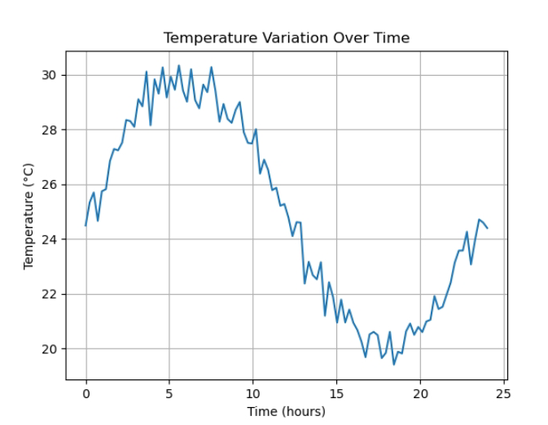
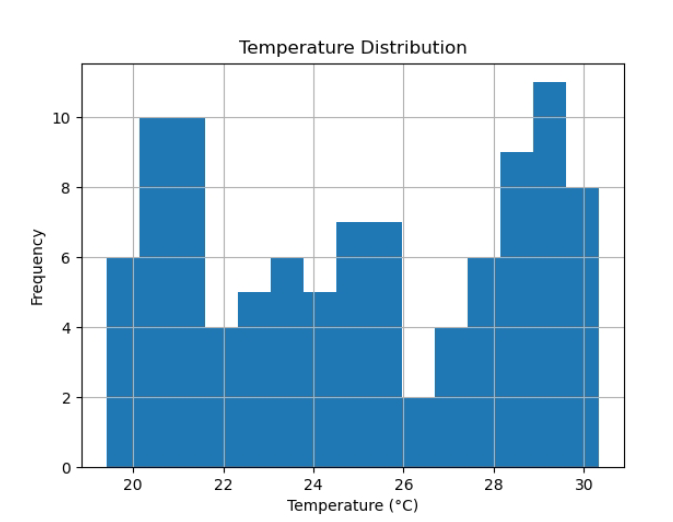

# Statistical Analysis of Temperature Variation

## 📖 Overview
This project analyzes temperature variation over a 24-hour period using simulated data based on physical principles.

The dataset combines periodic behavior (sinusoidal function) with random noise to mimic real-world environmental conditions.

## ⚙️ Methods
- Time-series data simulation
- Statistical analysis (mean, max, min)
- Data visualization using matplotlib

## 📊 Results
The simulation demonstrates:
- Periodic temperature variation over time
- Distribution of temperature values

## 📈 Output

### Temperature vs Time

### Temperature Distribution

## 🧠 Skills Demonstrated
- Data analysis
- Mathematical modeling
- Python programming
- Data visualization

## ▶️ How to Run
1. Install Python
2. Install dependencies:
   pip install numpy matplotlib
3. Run:
   python analysis.py

## 🔬 Future Improvements
- Use real-world datasets (weather APIs)
- Apply regression models
- Extend to multi-variable analysis
  
## 🎯 Author
Desire Igweze
